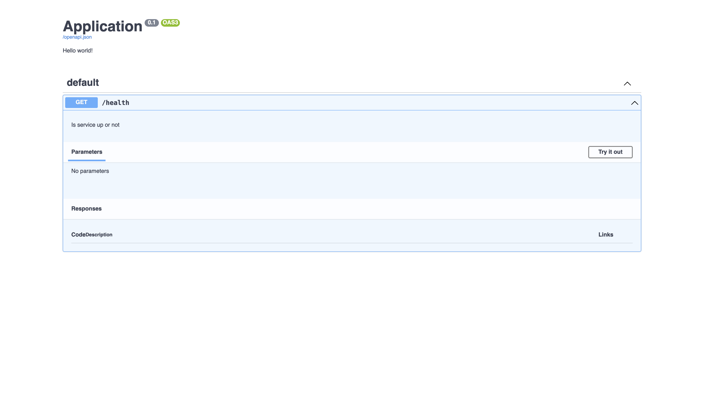

**This a fork of [openapi](https://github.com/jhuapl-saralab/openapi-ocaml/)**

# Openapi for Ocaml

This library is a fork of [openapi](https://github.com/jhuapl-saralab/openapi-ocaml/). The goal is to provide a way to generate Openapi UI not only for Opium, but for every http servers. To achieve this, this library provides a functor that'll create a layer above all the methods (`get`, `post`, `put`, ...) and generate a json and a documentation endpoint



# Usage

## Example with [Dream](https://github.com/aantron/dream)

```ocaml
module Config = struct
  type app = Dream.handler
  type route = Dream.route
  type handler = Dream.handler

  let json_path = "/openapi.json"
  let doc_path = "/docs"

  let json_route json = Dream.get json_path (fun _ -> Dream.json json)

  let doc_route html = Dream.get doc_path (fun _ -> Dream.html html)

  let get = Dream.get
  let post = Dream.post
  let delete = Dream.delete
  let put = Dream.put
  let options = Dream.options
  let head = Dream.head
  let patch = Dream.patch

  let build_routes = Dream.router
end

module OpenRouter = Openapi.Make (Config)

let start () =
  OpenRouter.empty
  |> OpenRouter.description "My app description"
  |> OpenRouter.get ~description:"Hello endpoint" "/hello" hello
  |> OpenRouter.build
  |> Dream.logger
  |> Dream.run ~interface:"0.0.0.0" ~port:8080
```

## Example with [Opium](https://github.com/rgrinberg/opium)

```ocaml
module Config = struct
  open Opium

  type app = App.t
  type handler = Rock.Handler.t
  type route = App.builder

  let json_path = "/openapi.json"
  let doc_path = "/docs"

  let json_route json =
    App.get json_path (fun _ ->
        Response.make
          ~headers:(Headers.of_list [("Content-Type", "application/json")])
          ~body:(Body.of_string json) ()
        |> Lwt.return)

  let doc_route html =
    App.get json_path (fun _ ->
        Response.make ~body:(Body.of_string html) () |> Lwt.return)

  let get = App.get
  let post = App.post
  let delete = App.delete
  let put = App.put
  let options = App.options
  let head = App.head
  let patch = App.patch
  let build_routes = List.fold_left (fun acc route -> route acc) App.empty
end

module OpenRouter = Openapi.Make (Config)

let start () =
  OpenRouter.empty
  |> OpenRouter.description "My app description"
  |> OpenRouter.get ~description:"Hello endpoint" "/hello" hello
  |> OpenRouter.build
  |> Opium.App.start
```
